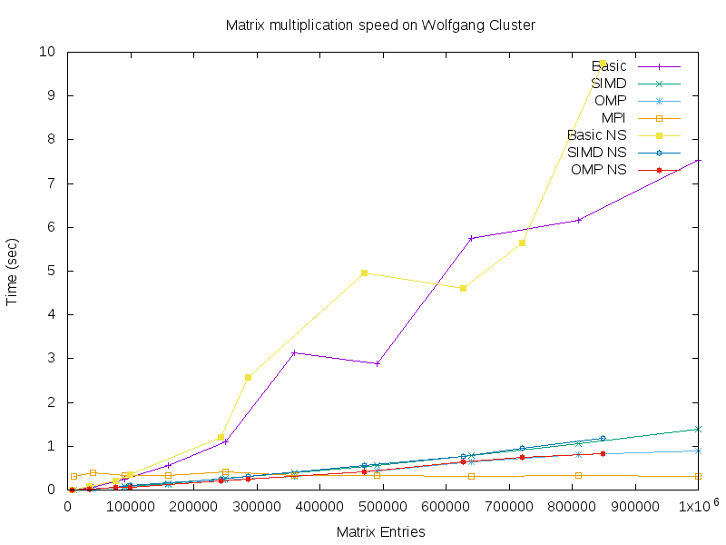

# Matrix Multiplication Parallelization

### Group members:

Christopher Park

Sungji Kim

Joe Ciccone

Chi Zhang

### Project Board:

[Trello Board Link](https://trello.com/b/qkwlwqlG/cis3296-lab6)

### ACCESSING THE CLUSTER

To access the cluster that the repo is hosted on, 
in terminal, first ssh into temple servers (WILL require password)
>cis-linux2.temple.edu

then ssh into opsrey (WILL require password)
>osprey.cis.temple.edu

then ssh into chinook (should NOT require password)
>chinook

Syntax for SSH:
`ssh "username"@cis-linux2.temple.edu`

sample log in:

`ssh tuj80083@cis-linux2.temple.edu`

>enter password

`ssh tuj80083@osprey.cis.temple.edu`

>enter password

`ssh chinook`

`cd matrix-01-park-kim-ciccone`

You are now inside the project file, use git commands to interact.

### EXITING THE CLUSTER

to leave the cluster that the repo is hosted on,
either close the terminal used to access the cluster
or if you want to return to the command line, use
`exit` 
three times to leave all three ssh's.

## 1. Distributed Parallel Computing

### Automation

For the purposes of automating test, an automation file was created. The automation file mainly takes advantage
of the system() function to run the other executables in this project. However, since the system() function can
only take a single argument, an sprintf() method is used to write the desired command line statement to run a 
particular executable into a string which is then given to the system() function. The output of this execution is
output into a txt file specific to that run. By using the "Time" command line command, we can get the execution time
data from each execution. The contents of each of these files would be formatted similar to below.

By running a for loop for the size of the matrices I want, I can populate my data folder with different execution
time data.

From here within each iteration of the for loop, I would open the file that was just created by a system() execution
and fgets() the first line, coming in the format "real X.XX". From here I can simply use the strtok() function
to get just the time token. I then compile all of these time datas into a GraphData.txt file to create a graph with. 

To include data for non-square matrix multiplication, I generate a random number for the m side of the matrix
using information from the for loop. However as a result of these random numbers being added in, using n-size 
no longer seems to be an accurate metric for my graph. As a result I use total matrix entries as my metric. 

An interesting point is that with this metric, with the exception of Basic, there is no significant difference 
in execution time between a particular method's square and non-square execution times. Perhaps there may be another
metric that shows a significant difference in execution times, but as of right now I cannot think of one.

### Matrix Multiplications without Parallelism

This implementation of Matrix Multiplication takes two text files as parameters. 
Each file containing a string in the format rows(n) cols(m) followed by an n x m matrix. 
It aquires the number of rows and columns for each matrix using fscanf(), it then generates
two matrices, using the data from the matrices in those files, using the modified gen_matrix().
It then compares the number of rows and columns in each and exits if they are not of the same dimensions,
the master then sends rows to each slave to do their calculations, when a slave is done it's calculation it stores it 
in a new matrix called cc1. When all of the calculations are finished the master it creates a new matrix cc2, and populates it
using the mmult() function provided, it then compares cc1 and cc2 to test if our program is doing the calculations
correctly and in the correct order. Finally, it writes the calculated matrix to a file called output.txt

### Matrix Multiplcations with SIMD

## Teammates

### Contributions

Christopher Park - 
Sungji Kim - 
Joe Ciccone -
Chi Zhang - 

### Peer Review

Much of the reviewing was done through manual testing. When a task was deemed complete by the person working on it, 
a pull request would be made. Since the master branch has a protection rule requiring at least one other user to 
approve the pull request, these changes are forced to be reviewed by someone other than the implementor. The testing
generally involves reviewing data to make sure nothing looks incredibly strange and could indicate an error, and manually
running the executables to ensure smooth operation.

## Full Project Life Cycle

While our group did have an associated trello board for our project, it was not used to its greatest potential.
As members of our group were not always updating the board with current changes on each person's end, there were some
miscommunications regarding who was to accomplish which task. This naturally resulted in some overriding of work.
Much of our coordination was done very loosely through a group text chat.

For generating matrices of specific or random sizes, some work has been put into this. In the automation.c file, the
arguments in the for loop control the data used for the square matrix multiplications. 

In this given implementation, runs would start with 100 x 100 size matrices as indicated by int i's start value. 
The last argument gives my increment for the size and the middle argument gives my end point. So for this run
I would run until 500 x 500 matrices incrementing by 100 each iteration. 

The generation of non-square matrices was a little more complicated. I still kept the outside edges of the two 
matrices to be multiplied the same as int i provided in the for loop. That said, I use the rand() function to
create my m-size for non-square matrices. I then provide the n value (from the for loop) and the m value
(from my rand() call) to a mmult method similar to the one for square matrices, but redesigned to tackle
non-square matrices. The biggest pitfall of this implementation however is that the rand() function is not
truly random so I will get the same result with each run of the automated testing.
